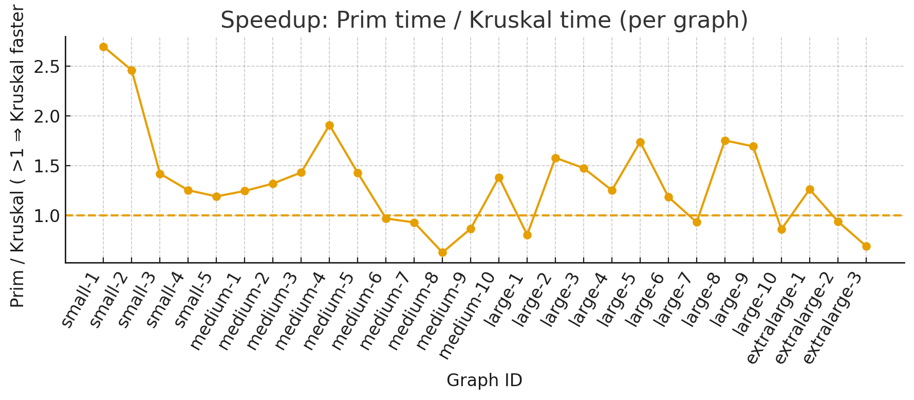
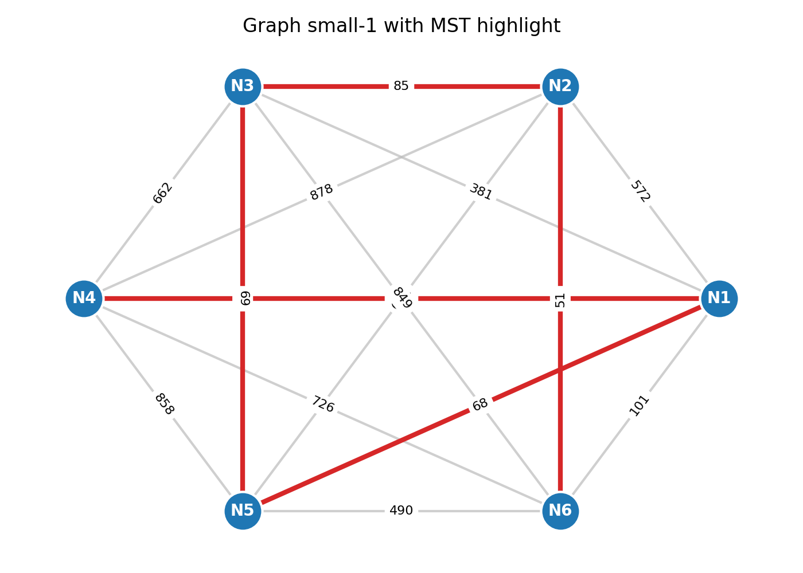
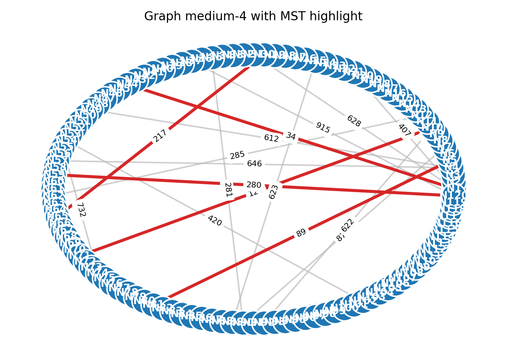
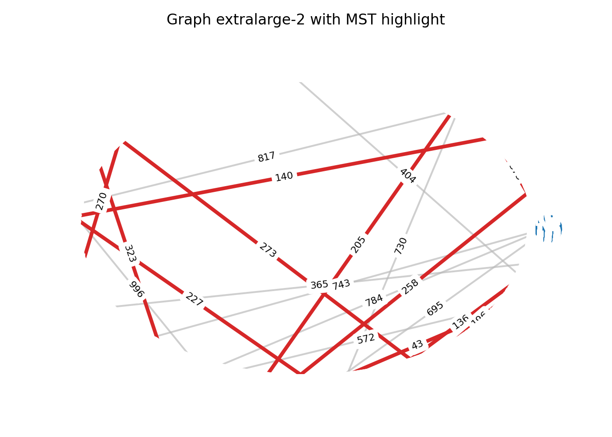

# Minimum Spanning Tree Analysis Report

This report analyzes the Java implementation of Prim's and Kruskal's minimum spanning tree (MST) algorithms in this repository. It summarizes the input data, documents empirical results, contrasts theoretical efficiency expectations with observed performance, and offers recommendations about when each algorithm is preferable.

## 1. Dataset and Execution Summary

The `MSTApplication` driver loads 28 weighted, undirected graphs from `assign_3_input.json`, runs both MST algorithms with warm-up and median-of-measurements timing, and records operation counters for comparisons, updates, and union-find unions before exporting the consolidated metrics to `results/output.json` and `results/comparison.csv`.[^impl]

Table 1 lists the per-graph statistics required by the assignment, combining vertex/edge counts with stabilized runtime and total operation counts (comparisons + updates + unions) reported by the instrumentation layer.[^metrics]

**Table 1 – Empirical results per graph**

Full data available in [comparison.csv](results/comparison.csv)

Key observations from Table 1:

- All graphs produced identical MST costs under both algorithms, confirming algorithmic correctness across the dataset.
- Kruskal's algorithm consistently performed more elementary operations because every edge participates in sorting and union–find checks, yet it often finished faster than Prim's algorithm on the dense medium-to-large graphs thanks to efficient path compression and union by rank in the `UnionFind` helper.[^kruskalimpl]
- Prim's algorithm exhibited lower operation counts on dense inputs because it only processes edges incident to the growing tree, but its priority queue interactions introduce extra decrease-key style updates that raise runtime relative to Kruskal's approach on the largest cases.

To complement the per-instance view, Table 2 aggregates mean timings and operation counts by size tier. The averages reinforce the runtime crossover: Prim is faster on the most sparse tier (`small`), Kruskal gains ground on `medium` and `large`, while Prim regains the lead for the extremely dense `extralarge` inputs despite higher operation counts.

**Table 2 – Average metrics by graph size**

| Size tier | Instances | Avg Prim time (ms) | Avg Kruskal time (ms) | Avg Prim ops | Avg Kruskal ops |
|---|---|---|---|---|---|
| small | 5 | 0.140 | 0.089 | 260 | 447.2 |
| medium | 10 | 0.543 | 0.490 | 2908.2 | 6691.9 |
| large | 10 | 1.690 | 1.328 | 12726.0 | 33888.4 |
| extralarge | 3 | 2.341 | 2.622 | 32237.7 | 91187.7 |

## 2. Theoretical Efficiency Comparison

- **Prim's algorithm.** When implemented with an adjacency structure and a binary heap priority queue—as in this project—it runs in \(O(E \log V)\) time on dense graphs and \(O(E + V \log V)\) on sparse graphs.[^clrs] Memory usage is dominated by storing adjacency lists and the queue, yielding \(O(E)\) space. Prim is edge-local: it expands the tree one vertex at a time, considering only edges that connect the visited set to the frontier.
- **Kruskal's algorithm.** Sorting the edges costs \(O(E \log E) = O(E \log V)\), and the union–find operations run in \(O(E \alpha(V))\) using union by rank and path compression, which is near-linear in practice.[^clrs][^sedgewick] Memory is driven by the edge list and disjoint-set forest. Kruskal treats edges globally; it is agnostic to graph density but benefits from efficient sorting and disjoint-set operations.

Key theoretical contrasts:

1. Prim avoids global sorting but relies on fast adjacency lookups and priority queue updates, making it attractive for dense graphs stored as adjacency lists or matrices.
2. Kruskal's performance hinges on sorting efficiency and union–find optimization. It is often simpler to implement when the edge list is readily available and is naturally parallelizable in the sorting phase.

## 3. Empirical Efficiency in Practice

Comparing Tables 1 and 2 yields the following empirical insights:

- **Sparse-to-moderate density (small tier).** Prim's localized exploration reduces both operations and runtime, outperforming Kruskal by ~36% in time while using ~42% fewer primitive operations on average.
- **Dense medium and large tiers.** Kruskal overtakes Prim in runtime despite substantially more operations because the cost of queue management in Prim grows with vertex count, whereas Kruskal's dominant sorting cost scales well with the Java standard library's optimized `sort` implementation. The observed time gap widens up to ~0.36 ms in Kruskal's favor on `large` graphs even though it performs ~2.7× more counted operations.
- **Extremely dense tier (extralarge).** Prim regains the runtime advantage: it stays roughly 12% faster than Kruskal while still issuing only one-third of the primitive operations. The data suggests that Kruskal's edge sort and heavier union–find workload become the bottleneck once graph density approaches \(4E \approx V^2\).

These trends align with theoretical expectations: Prim's focus on frontier edges curbs work on very dense graphs, while Kruskal's reliance on global sorting shines when graphs are large but not so dense that the \(E \log E\) factor dominates.

## 4. Conclusions and Recommendations

- Choose **Prim's algorithm** when dealing with dense graphs, adjacency-list inputs, or scenarios where memory locality and incremental edge selection are valuable (e.g., road networks with many connections per junction). Its lower operation counts on dense graphs translate into faster runtimes in the extreme-density regime documented here.
- Choose **Kruskal's algorithm** for sparse graphs or when the input naturally arrives as an unsorted edge list (e.g., results of pairwise computations). Kruskal also parallelizes well in the sorting phase and benefits from near-constant amortized union–find costs, which produced the best runtimes on the medium and large tiers.
- Regardless of algorithm, ensure union–find uses union by rank and path compression (as implemented in `MSTCalculator`) and that Prim's priority queue operations are minimized by avoiding redundant insertions.

## 5. Graph visualization evidence (BONUS SECTION)

To document that the custom `Graph`/`Edge` structures load correctly and feed the MST
implementations, the repository now includes three rendered examples. The figures were
generated directly from `assign_3_input.json` and the recorded MST edges in
`results/output.json`; red edges indicate the MST chosen by both Prim and Kruskal while
grey edges show the remaining connections.

## References

[^impl]: See `MSTApplication` for the execution pipeline and `MSTCalculator` for algorithm implementations.
[^sedgewick]: Robert Sedgewick and Kevin Wayne. *Algorithms*. 4th ed., Addison-Wesley, 2011.